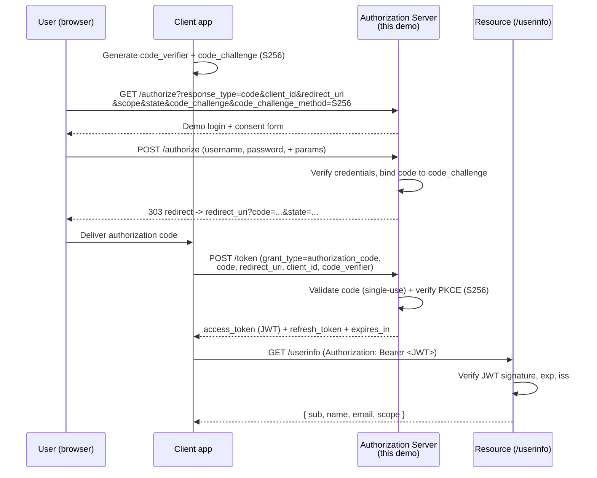

# oauth2-server-demo

> A minimal, readable OAuth2 Authorization Server implementing the Authorization Code grant with PKCE — built with FastAPI, for learning.


-orange)


---

## Overview

`oauth2-server-demo` is a small, heavily-commented OAuth2 **Authorization Server** you
can read end-to-end in one sitting. It implements the modern recommended flow for public
clients (SPAs and native apps): the **Authorization Code grant with PKCE** (RFC 6749 +
RFC 7636), issues **signed JWT access tokens**, and exposes a protected `/userinfo`
resource plus an RFC 8414 discovery document.

Everything is in-memory and intentionally tiny. The goal is clarity — to show *how* the
pieces fit together — not to be a drop-in identity provider.

> [!WARNING]
> **This is an educational demo, NOT production software.** It uses in-memory stores, a
> hard-coded signing secret, plaintext demo passwords, and skips CSRF/session hardening.
> See [Security notes](#security-notes) before you even think about deploying it.

## Architecture

The Authorization Code + PKCE flow implemented here:



## Endpoints

| Method | Path                                        | Purpose                                                                 |
| ------ | ------------------------------------------- | ----------------------------------------------------------------------- |
| GET    | `/authorize`                                | Render the demo login + consent form.                                   |
| POST   | `/authorize`                                | Verify credentials, mint a PKCE-bound authorization code, redirect back.|
| POST   | `/token`                                    | Exchange a code (or refresh token) for tokens; validates PKCE.          |
| GET    | `/userinfo`                                 | Protected resource; requires a `Bearer` JWT access token.               |
| GET    | `/.well-known/oauth-authorization-server`   | RFC 8414 authorization server metadata (discovery).                     |

## Features

- **Authorization Code grant + PKCE (S256)** — PKCE is mandatory, mirroring the public-client best practice.
- **Signed JWT access tokens** via PyJWT (`iss`, `sub`, `aud`, `scope`, `iat`, `exp`, `jti`).
- **Opaque, rotating refresh tokens** — state kept server-side so revocation is a single flag.
- **Single-use authorization codes** bound to `client_id` + `redirect_uri` + `code_challenge`.
- **RFC-shaped error responses** (`error` / `error_description`).
- **RFC 8414 discovery** document.
- **Readable by design** — small modules, docstrings that cite the relevant RFC sections.

## Tech stack

| Concern            | Choice                          |
| ------------------ | ------------------------------- |
| Web framework      | FastAPI                         |
| ASGI server        | uvicorn                         |
| Data models        | Pydantic v2 + dataclasses       |
| JWT signing        | PyJWT (HS256, demo secret)      |
| Form parsing       | python-multipart                |
| Tests              | pytest + Starlette `TestClient` |

## Getting started

Requires Python 3.10+.

```bash
# 1. Clone, then create a virtual environment
python -m venv .venv
source .venv/bin/activate        # Windows: .venv\Scripts\activate

# 2. Install (editable) with dev extras for running the tests
pip install -e ".[dev]"

# 3. Run the server
uvicorn authserver.main:app --reload --port 8000
```

Interactive API docs are then at <http://localhost:8000/docs>.

**Seeded demo credentials** (clearly fake):

| Field        | Value                          |
| ------------ | ------------------------------ |
| client_id    | `demo-client`                  |
| redirect_uri | `http://localhost:8080/callback` |
| username     | `demo-user`                    |
| password     | `demo-password`                |
| scopes       | `openid profile email`         |

## Usage

A full end-to-end walkthrough with `curl`. It assumes the server is running on
`http://localhost:8000`.

### 1. Generate a PKCE verifier + challenge

```bash
CODE_VERIFIER=$(python -c "import secrets;print(secrets.token_urlsafe(64))")
CODE_CHALLENGE=$(python -c "import base64,hashlib,sys;print(base64.urlsafe_b64encode(hashlib.sha256(sys.argv[1].encode()).digest()).rstrip(b'=').decode())" "$CODE_VERIFIER")
echo "verifier=$CODE_VERIFIER"
echo "challenge=$CODE_CHALLENGE"
```

### 2. Log in and get an authorization code

The `/authorize` POST performs the demo login/consent and issues a `303` redirect whose
`Location` header carries the `code`. `-i` prints headers so you can read it; `curl` does
not follow the redirect to the (unserved) callback here.

```bash
curl -i -s -X POST http://localhost:8000/authorize \
  -d response_type=code \
  -d client_id=demo-client \
  -d redirect_uri=http://localhost:8080/callback \
  -d "scope=openid profile email" \
  -d state=xyz-123 \
  -d code_challenge="$CODE_CHALLENGE" \
  -d code_challenge_method=S256 \
  -d username=demo-user \
  -d password=demo-password
# -> HTTP/1.1 303 See Other
# -> location: http://localhost:8080/callback?code=<AUTH_CODE>&state=xyz-123
```

Copy the `code` value from the `location` header into `AUTH_CODE`:

```bash
AUTH_CODE=paste-the-code-here
```

### 3. Exchange the code for tokens (PKCE verified here)

```bash
curl -s -X POST http://localhost:8000/token \
  -d grant_type=authorization_code \
  -d code="$AUTH_CODE" \
  -d redirect_uri=http://localhost:8080/callback \
  -d client_id=demo-client \
  -d code_verifier="$CODE_VERIFIER"
# -> {"access_token":"eyJ...","token_type":"Bearer","expires_in":3600,
#     "refresh_token":"...","scope":"openid profile email"}
```

### 4. Call the protected resource

```bash
ACCESS_TOKEN=paste-the-access_token-here
curl -s http://localhost:8000/userinfo \
  -H "Authorization: Bearer $ACCESS_TOKEN"
# -> {"sub":"user-001","name":"Demo User","email":"demo-user@example.com",
#     "scope":"openid profile email"}
```

### 5. (Optional) Refresh the access token

```bash
REFRESH_TOKEN=paste-the-refresh_token-here
curl -s -X POST http://localhost:8000/token \
  -d grant_type=refresh_token \
  -d refresh_token="$REFRESH_TOKEN" \
  -d client_id=demo-client
```

## Security notes

> [!CAUTION]
> **Educational demo — do not use in production as-is.** The shortcuts below are
> deliberate simplifications made for readability.

- **In-memory everything.** Clients, users, codes, and refresh tokens live in process
  memory and vanish on restart. No database, no persistence.
- **Hard-coded HS256 secret.** Access tokens are signed with a symmetric demo secret
  baked into the source (`tokens.DEMO_JWT_SECRET`). Production servers use asymmetric keys
  (RS256/ES256) loaded from a secret manager, rotated regularly, and published via JWKS.
- **Plaintext demo passwords.** Credentials are compared in plaintext. Real servers store
  salted password hashes (argon2/bcrypt) — never plaintext.
- **No CSRF / session hardening** on the login form, and no rate limiting or brute-force
  protection.
- **No TLS.** The issuer is `http://localhost`. OAuth2 requires HTTPS everywhere in reality.
- **Minimal validation** of scopes and redirect URIs beyond what the flow needs to teach.

What the demo *does* get right (and is worth studying): PKCE S256 with constant-time
comparison, single-use auth codes bound to client + redirect_uri + challenge, refresh-token
rotation, and RFC-shaped error responses.

## Project structure

```
oauth2-server-demo/
├── authserver/
│   ├── __init__.py        # package metadata
│   ├── models.py          # Pydantic wire models + internal dataclasses
│   ├── pkce.py            # RFC 7636 S256 challenge compute + verify
│   ├── tokens.py          # JWT access-token mint/verify, opaque refresh mint
│   ├── store.py           # in-memory clients/users/codes/refresh tokens (DEMO seed)
│   └── main.py            # FastAPI app + routes (the OAuth2 flow)
├── tests/
│   ├── conftest.py        # fixtures: fresh app/store, PKCE pair helper
│   └── test_flow.py       # happy path + PKCE-mismatch + bad-client + edge cases
├── .github/workflows/ci.yml
├── pyproject.toml
├── requirements.txt
├── LICENSE
└── README.md
```

## Testing

```bash
pip install -e ".[dev]"
pytest -q
```

The suite drives the full Authorization Code + PKCE flow through the ASGI app with
Starlette's `TestClient` (no network): a happy path (`/authorize` → `/token` → `/userinfo`
→ refresh), plus PKCE-mismatch rejection, unknown-client rejection at both `/authorize` and
`/token`, single-use-code enforcement, bad credentials, bearer-token validation, and the
discovery document. CI runs it on Python 3.10–3.12.

## Roadmap

- [ ] OpenID Connect `id_token` issuance
- [ ] Asymmetric signing (RS256) + JWKS endpoint (`/.well-known/jwks.json`)
- [ ] Token introspection (RFC 7662) and revocation (RFC 7009) endpoints
- [ ] Confidential clients with `client_secret` + `client_credentials` grant
- [ ] Pluggable persistence (swap the in-memory store for a database)

## License

MIT — see [LICENSE](LICENSE). Copyright (c) 2026 Matthews Wong.

---

*Part of my cloud & AI portfolio — see [github.com/matthews-wong](https://github.com/matthews-wong).*
